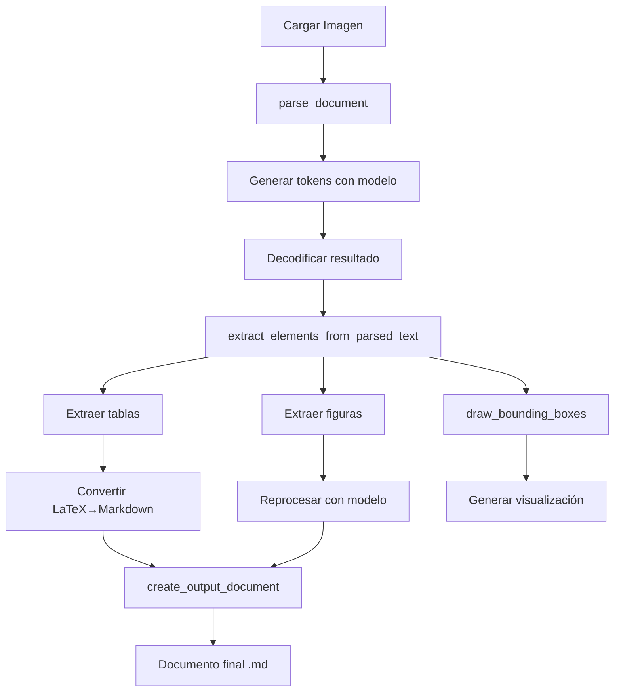
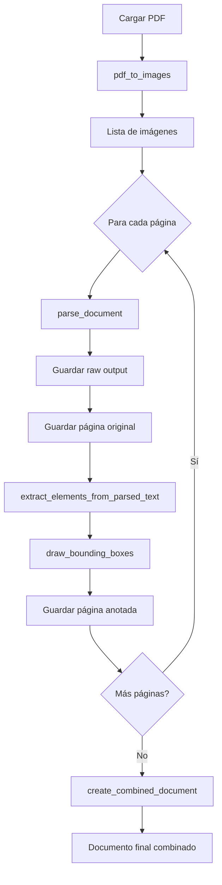

# 📄 parse_local.py - Documentación Completa

## Índice
1. [Descripción General](#descripción-general)
2. [Requisitos](#requisitos)
3. [Arquitectura y Componentes](#arquitectura-y-componentes)
4. [Funciones Principales](#funciones-principales)
5. [Flujo de Trabajo](#flujo-de-trabajo)
6. [Uso](#uso)
7. [Estructura de Salida](#estructura-de-salida)
8. [Características Avanzadas](#características-avanzadas)
9. [Limitaciones y Consideraciones](#limitaciones-y-consideraciones)
10. [Ejemplos Prácticos](#ejemplos-prácticos)

---

## Descripción General

`parse_local.py` es una herramienta avanzada de **parsing de documentos** que utiliza el modelo de IA **NVIDIA Nemotron-Parse v1.1** para extraer y estructurar contenido de documentos PDF e imágenes. La herramienta es capaz de:

- 🔍 **Detectar y clasificar** diferentes tipos de elementos en documentos (texto, títulos, tablas, figuras, fórmulas, etc.)
- 📊 **Extraer tablas** y convertirlas automáticamente de formato LaTeX a Markdown
- 🖼️ **Identificar y extraer figuras** con reprocesamiento para análisis detallado
- 📐 **Generar visualizaciones** con bounding boxes coloreados para cada elemento detectado
- 📑 **Procesar PDFs completos** página por página manteniendo la estructura original
- 🎯 **Crear documentos Markdown** estructurados con referencias a tablas e imágenes extraídas

### Ventajas Clave
- ✅ Soporte para GPU (CUDA) con fallback a CPU
- ✅ Procesamiento automático de múltiples páginas
- ✅ Extracción inteligente con márgenes adaptativos
- ✅ Autocrop de bordes blancos en imágenes extraídas
- ✅ Conversión automática de tablas LaTeX a Markdown
- ✅ Reprocesamiento de figuras para análisis detallado
- ✅ Visualización completa con bounding boxes coloreados

---

## Requisitos

### Dependencias Python
```bash
pip install torch transformers pillow pymupdf numpy
```

### Bibliotecas Específicas
- **torch**: Framework de deep learning para ejecutar el modelo
- **transformers**: Biblioteca de Hugging Face para cargar modelos pre-entrenados
- **PIL (Pillow)**: Procesamiento de imágenes
- **fitz (PyMuPDF)**: Conversión de PDF a imágenes
- **numpy**: Operaciones numéricas para autocrop

### Token de Hugging Face
El modelo requiere autenticación con Hugging Face. Tienes tres opciones:

#### Opción 1: Hugging Face CLI Login (Recomendada)
```bash
# Instalar Hugging Face CLI (si no está instalado)
pip install huggingface_hub

# Hacer login interactivo
huggingface-cli login

# Verificar que estás autenticado
huggingface-cli whoami
```

Esta opción guarda el token en `~/.huggingface/token` y la biblioteca `transformers` lo detecta automáticamente. **Es la forma más segura y conveniente**.

#### Opción 2: Variable de entorno
```bash
# PowerShell (sesión actual)
$env:HF_TOKEN = "hf_tu_token_aqui"

# PowerShell (permanente - Usuario)
[Environment]::SetEnvironmentVariable("HF_TOKEN", "hf_tu_token_aqui", "User")

# Bash/Linux
export HF_TOKEN="hf_tu_token_aqui"

# CMD (Windows)
set HF_TOKEN=hf_tu_token_aqui
```

#### Opción 3: Modificar directamente en el código
Editar línea 14 de `parse_local.py`:
```python
token = "hf_tu_token_aqui"  # Reemplazar None por tu token
```

**⚠️ Nota**: Si ya usaste `huggingface-cli login`, no necesitas configurar nada más. El script funcionará automáticamente.

### Hardware Recomendado
- **GPU**: NVIDIA con soporte CUDA (recomendado para velocidad)
- **CPU**: Funciona pero más lento
- **RAM**: Mínimo 8GB, recomendado 16GB o más
- **VRAM**: 8GB o más para GPU (para documentos grandes)

---

## Arquitectura y Componentes

### Modelo de IA
```python
model_id = "nvidia/NVIDIA-Nemotron-Parse-v1.1"
```
- **Tipo**: Vision-Language Model (VLM)
- **Capacidades**: Detección de elementos, OCR, clasificación de contenido
- **Formato**: Genera output estructurado con coordenadas normalizadas y clases

### Detección de GPU
```python
device = "cuda" if torch.cuda.is_available() else "cpu"
```
Automáticamente detecta y utiliza GPU si está disponible.

### Formato de Output del Modelo
El modelo genera texto estructurado con el siguiente formato:
```
</s><s><predict_bbox><predict_classes><output_markdown>
<x_0.1><y_0.2>Contenido del elemento<x_0.5><y_0.3><class_Text>
```

Donde:
- `<x_inicio><y_inicio>`: Coordenadas normalizadas (0-1) del inicio del elemento
- `Contenido`: Texto o contenido del elemento
- `<x_fin><y_fin>`: Coordenadas normalizadas del final del elemento
- `<class_Tipo>`: Clase/tipo del elemento detectado

---

## Funciones Principales

### 1. `parse_document(image_path)`
**Propósito**: Función principal que procesa una imagen con el modelo Nemotron.

**Parámetros**:
- `image_path` (str): Ruta a la imagen a procesar

**Proceso**:
1. Carga la imagen y la convierte a RGB
2. Aplica el prompt de tarea específico: `</s><s><predict_bbox><predict_classes><output_markdown>`
3. Procesa la imagen con el modelo usando el procesador
4. Genera tokens con configuración extendida (max_new_tokens=16384)
5. Decodifica el resultado a texto
6. Verifica si el output está truncado

**Retorna**: String con el texto parseado incluyendo coordenadas y clasificaciones

**Características Especiales**:
- Desactiva cache por bug conocido del modelo
- Usa tokens extendidos para tablas muy grandes
- Advertencia si el output parece truncado

---

### 2. `autocrop_white_borders(image, threshold, margin, min_crop_ratio)`
**Propósito**: Elimina automáticamente bordes blancos de imágenes extraídas.

**Parámetros**:
- `image` (PIL Image): Imagen a procesar
- `threshold` (int, default=240): Umbral de brillo para considerar "blanco" (0-255)
- `margin` (int, default=10): Píxeles de margen a mantener
- `min_crop_ratio` (float, default=0.05): Ratio mínimo de recorte para activar

**Algoritmo**:
1. Convierte imagen a array numpy y escala de grises
2. Detecta filas y columnas con contenido (píxeles < threshold)
3. Calcula límites del contenido con márgenes
4. Verifica que el recorte sea significativo (>5% en alguna dimensión)
5. Valida que no se recorte más del 70% del contenido
6. Retorna imagen recortada o original si no cumple criterios

**Retorna**: PIL Image recortada o imagen original

**Casos de Uso**:
- Eliminar espacios blancos excesivos en tablas extraídas
- Limpiar bordes de figuras escaneadas
- Optimizar tamaño de archivos de salida

---

### 3. `reprocess_figure(figure_image_path, figure_name)`
**Propósito**: Reprocesa una figura extraída con el modelo para análisis detallado.

**Parámetros**:
- `figure_image_path` (str): Ruta a la imagen de la figura
- `figure_name` (str): Nombre identificador de la figura

**Proceso**:
1. Carga la imagen de la figura
2. Aplica el mismo prompt del procesamiento principal
3. Genera análisis detallado con el modelo
4. Limpia el resultado eliminando tags de coordenadas y clases
5. Retorna contenido extraído en formato limpio

**Retorna**: String con contenido textual extraído de la figura

**Manejo de Errores**: Captura excepciones y retorna string vacío en caso de fallo

---

### 4. `latex_table_to_markdown(latex_table)`
**Propósito**: Convierte tablas en formato LaTeX a formato Markdown.

**Parámetros**:
- `latex_table` (str): Tabla en formato LaTeX

**Proceso de Conversión**:
1. Extrae contenido entre `\begin{tabular}` y `\end{tabular}`
2. Limpia comandos LaTeX:
   - `\multirow{...}{...}{contenido}` → `contenido`
   - `\multicolumn{...}{...}{contenido}` → `contenido`
   - `\textbf{texto}` → `**texto**`
3. Divide contenido en filas usando `\\` como separador
4. Para cada fila:
   - Divide columnas usando `&` como separador
   - Genera fila Markdown: `| col1 | col2 | col3 |`
5. Añade línea separadora después del encabezado: `| --- | --- | --- |`

**Retorna**: String con tabla en formato Markdown

**Manejo de Errores**: Retorna tabla original si la conversión falla

**Ejemplo**:
```latex
\begin{tabular}{|c|c|}
\textbf{Header1} & \textbf{Header2} \\
Value1 & Value2 \\
\end{tabular}
```
→
```markdown
| **Header1** | **Header2** |
| --- | --- |
| Value1 | Value2 |
```

---

### 5. `draw_bounding_boxes(image, parsed_text, output_path, page_num)`
**Propósito**: Genera visualización con bounding boxes coloreados para cada elemento detectado.

**Parámetros**:
- `image` (PIL Image): Imagen original
- `parsed_text` (str): Texto parseado con coordenadas
- `output_path` (str): Ruta donde guardar imagen anotada
- `page_num` (int, opcional): Número de página para el título

**Colores por Tipo de Elemento**:
```python
colors = {
    'Text': '#4CAF50',          # Verde
    'Title': '#2196F3',         # Azul
    'Section-header': '#3F51B5', # Azul índigo
    'Table': '#FF5722',         # Naranja rojizo
    'Figure': '#9C27B0',        # Púrpura
    'Picture': '#9C27B0',       # Púrpura
    'Formula': '#FF9800',       # Naranja
    'Caption': '#00BCD4',       # Cian
    'List-item': '#8BC34A',     # Verde claro
    'Page-header': '#9E9E9E',   # Gris
    'Page-footer': '#9E9E9E',   # Gris
    'Footnote': '#795548',      # Marrón
    'Bibliography': '#607D8B',  # Gris azulado
    'TOC': '#FFC107'            # Ámbar
}
```

**Proceso de Dibujo**:
1. Extrae todos los elementos con sus coordenadas del texto parseado
2. Convierte coordenadas normalizadas (0-1) a píxeles
3. Aplica márgenes adaptativos según tipo de elemento:
   - **Tablas**: margin_left=35, margin_top=0, margin_right=35, margin_bottom=0
   - **Figuras**: margin=200 en todos los lados
   - **Otros**: margin_left=45, margin_top=20, margin_right=45, margin_bottom=20
4. Dibuja dos rectángulos por elemento:
   - Rectángulo fino con coordenadas originales
   - Rectángulo grueso con márgenes aplicados
5. Añade etiqueta con fondo de color y texto blanco
6. Opcional: Añade título con contador de elementos si se proporciona page_num

**Retorna**: Número de elementos dibujados (int)

**Características**:
- Líneas adaptativas según resolución de imagen
- Fuentes escalables automáticamente
- Validación y corrección de coordenadas invertidas
- Prevención de etiquetas fuera de los límites de imagen

---

### 6. `extract_elements_from_parsed_text(parsed_text, original_image, output_dir, table_count, image_count, page_num)`
**Propósito**: Extrae elementos individuales del texto parseado y guarda tablas/imágenes.

**Parámetros**:
- `parsed_text` (str): Texto parseado del modelo
- `original_image` (PIL Image): Imagen original de referencia
- `output_dir` (str): Directorio base de salida
- `table_count` (int): Contador de tablas acumulado
- `image_count` (int): Contador de imágenes acumulado
- `page_num` (int, opcional): Número de página

**Estructura de Directorios Creada**:
```
output_dir/
├── images/        # Figuras extraídas
└── tables/        # Tablas extraídas
```

**Proceso de Extracción**:

#### Para Tablas (`class_type == 'Table'`):
1. Incrementa contador de tablas
2. Convierte coordenadas normalizadas a píxeles
3. Aplica márgenes generosos: left=120, top=80, right=120, bottom=50
4. Recorta región de imagen de la tabla
5. Aplica `autocrop_white_borders()` para eliminar espacios
6. Guarda imagen: `tables/table_N.png`
7. Convierte contenido LaTeX a Markdown
8. Guarda Markdown: `tables/table_N.md`
9. Crea referencia: `[Tabla N - Página X](tables/table_N.png)`

#### Para Figuras (`class_type in ['Picture', 'Figure']`):
1. Incrementa contador de imágenes
2. Convierte coordenadas a píxeles
3. Aplica márgenes muy generosos: margin=200 en todos lados (captura títulos/leyendas)
4. Recorta región de imagen
5. Aplica `autocrop_white_borders()`
6. Guarda imagen: `images/figure_N.png`
7. **Reprocesa figura** con `reprocess_figure()` para análisis detallado
8. Si hay detalles extraídos:
   - Guarda `images/figure_N.md` con contenido extraído
   - Incluye imagen en el documento markdown
9. Crea referencia: `[Figura N - Página X](images/figure_N.png)`

**Estructura de Elementos Retornados**:
```python
{
    'type': 'Table',  # o 'Figure', 'Text', etc.
    'content': 'contenido extraído',
    'bbox': (x1_px, y1_px, x2_px, y2_px),  # en píxeles
    'coords_normalized': (x1, y1, x2, y2),  # 0-1
    'image_path': 'ruta/a/imagen.png',
    'markdown_path': 'ruta/a/tabla.md',  # solo tablas
    'details_path': 'ruta/a/figura.md',  # solo figuras
    'reference': '[Tabla 1 - Página 2](tables/table_1.png)',
    'page': 2  # si se proporciona page_num
}
```

**Retorna**: Tupla (elements, table_count, image_count)

---

### 7. `create_output_document(parsed_text, elements, output_path)`
**Propósito**: Crea documento Markdown estructurado para imagen única.

**Parámetros**:
- `parsed_text` (str): Texto parseado
- `elements` (list): Lista de elementos extraídos
- `output_path` (str): Ruta del archivo de salida

**Generación de Contenido por Tipo**:

| Tipo de Elemento | Formato Markdown |
|------------------|------------------|
| `Table` | Contenido de tabla.md incluido |
| `Picture/Figure` | `` |
| `Caption` | `**Contenido en negrita**` |
| `Text` | Párrafo normal |
| `Title` | `## Título` |
| `Section-header` | `## Encabezado` |
| `List-item` | `- Elemento de lista` |
| `Footnote` | `_Nota en cursiva_` |
| `Formula` | Contenido preservado |
| `TOC` | `**Índice:**\n\nContenido` |
| `Bibliography` | `**Referencias:**\n\nContenido` |
| `Page-header` | `_Encabezado en cursiva_` |
| `Page-footer` | `_Pie en cursiva_` |

**Ordenamiento**: Los elementos se ordenan por coordenada Y para mantener orden de lectura

**Retorna**: Ruta del archivo creado (str)

---

### 8. `pdf_to_images(pdf_path, dpi)`
**Propósito**: Convierte documento PDF a imágenes (una por página).

**Parámetros**:
- `pdf_path` (str): Ruta al archivo PDF
- `dpi` (int, default=300): Resolución de conversión

**Proceso**:
1. Abre documento PDF con PyMuPDF
2. Para cada página:
   - Crea matriz de transformación basada en DPI
   - Convierte página a pixmap
   - Convierte pixmap a PIL Image RGB
   - Almacena imagen con número de página
3. Cierra documento PDF

**Retorna**: Lista de diccionarios
```python
[
    {
        'image': PIL.Image,
        'page_num': 1
    },
    ...
]
```

**Cálculo de Resolución**:
```python
mat = fitz.Matrix(dpi/72, dpi/72)  # 72 DPI es la base de PDF
```

**Ejemplos de DPI**:
- **150 DPI**: Rápido, calidad media (archivos pequeños)
- **300 DPI**: Balance óptimo (recomendado)
- **600 DPI**: Alta calidad, procesamiento lento (archivos grandes)

---

### 9. `process_pdf(pdf_path, output_directory, dpi)`
**Propósito**: Procesa PDF completo página por página con extracción completa.

**Parámetros**:
- `pdf_path` (str): Ruta al PDF
- `output_directory` (str): Directorio de salida
- `dpi` (int, default=300): Resolución de conversión

**Estructura Completa de Salida**:
```
output_directory/
├── images/              # Figuras extraídas de todas las páginas
├── tables/              # Tablas extraídas de todas las páginas
├── raw_output/          # Resultados crudos del modelo
│   ├── page_1_raw.txt
│   ├── page_2_raw.txt
│   └── ...
├── pages/               # Páginas originales en PNG
│   ├── page_1.png
│   ├── page_2.png
│   └── ...
├── annotated_pages/     # Páginas con bounding boxes
│   ├── page_1_annotated.png
│   ├── page_2_annotated.png
│   └── ...
└── documento_parseado.md  # Documento combinado final
```

**Flujo de Procesamiento por Página**:
1. **Conversión**: Convierte PDF a lista de imágenes
2. **Para cada página**:
   - Guarda imagen temporal
   - Parsea con `parse_document()`
   - Guarda resultado crudo en `raw_output/page_N_raw.txt`
   - Guarda página original en `pages/page_N.png`
   - Extrae elementos con `extract_elements_from_parsed_text()`
   - Genera imagen anotada con `draw_bounding_boxes()`
   - Guarda en `annotated_pages/page_N_annotated.png`
   - Añade número de página a cada elemento
   - Acumula elementos y contadores
   - Limpia archivos temporales
3. **Post-procesamiento**:
   - Crea documento combinado con todas las páginas
   - Genera estadísticas totales

**Características de Progreso**:
```
=========================================
PROCESANDO PÁGINA 2 de 10 (2/10)
=========================================
[2/10] Parseando página 2...
✓ Resultado crudo guardado: page_2_raw.txt
✓ Página original guardada: page_2.png
[2/10] Extrayendo elementos de página 2...
[2/10] Generando imagen con bounding boxes...
✓ Página 2 completada: 15 elementos extraídos
  - Tablas: 2
  - Imágenes: 1
📊 Progreso: 2/10 páginas procesadas (20%)
```

**Retorna**: Tupla (all_parsed_results, all_elements)
- `all_parsed_results`: Lista de dicts con `{'page': N, 'result': str}`
- `all_elements`: Lista completa de elementos de todas las páginas

---

### 10. `create_combined_document(parsed_results, elements, output_path)`
**Propósito**: Crea documento Markdown combinado de todo el PDF con separadores de página.

**Parámetros**:
- `parsed_results` (list): Resultados parseados de cada página
- `elements` (list): Todos los elementos extraídos
- `output_path` (str): Ruta del documento final

**Estructura del Documento**:
```markdown
# Documento Parseado

---

**Página 1**

## Título de la sección

Contenido de texto...

**[Tabla 1 - Página 1](tables/table_1.png)**

| Columna 1 | Columna 2 |
| --- | --- |
| Valor 1 | Valor 2 |

---

**Página 2**

Más contenido...

**[Figura 1 - Página 2](images/figure_1.png)**


```

**Proceso**:
1. Añade encabezado principal
2. Para cada página del PDF:
   - Añade separador `---` y marcador de página
   - Filtra elementos de esa página específica
   - Extrae y ordena items por coordenada Y
   - Para cada item:
     - Si es tabla: incluye referencia + contenido markdown
     - Si es figura: incluye referencia + imagen embebida
     - Si es texto/título/etc: aplica formato apropiado
3. Guarda documento completo

**Retorna**: Ruta del archivo creado (str)

---

## Flujo de Trabajo

### Procesamiento de Imagen Única



### Procesamiento de PDF Completo



---

## Uso

### Sintaxis Básica

```bash
python parse_local.py <archivo_entrada> [opciones]
```

### Argumentos

| Argumento | Tipo | Descripción | Default |
|-----------|------|-------------|---------|
| `input_file` | Requerido | Archivo de entrada (PDF, JPG, PNG, etc.) | - |
| `-o, --output` | Opcional | Directorio de salida | `output_parsed` |
| `--dpi` | Opcional | DPI para conversión de PDF | `300` |

### Ejemplos de Uso

#### 1. Procesar PDF con configuración por defecto
```bash
python parse_local.py documento.pdf
```
**Resultado**: `output_parsed/documento/`

#### 2. Procesar con directorio de salida personalizado
```bash
python parse_local.py documento.pdf -o resultados_analisis
```
**Resultado**: `resultados_analisis/documento/`

#### 3. Procesar con DPI personalizado (mayor calidad)
```bash
python parse_local.py documento.pdf --dpi 600
```
**Uso**: Para documentos con texto muy pequeño o gráficos detallados

#### 4. Procesar imagen individual
```bash
python parse_local.py pagina_escaneada.jpg
```
**Resultado**: `output_parsed/pagina_escaneada/`

#### 5. Pipeline completo optimizado
```bash
python parse_local.py informe_tecnico.pdf -o analisis_informe --dpi 300
```

---

## Estructura de Salida

### Directorio Completo

```
output_parsed/
└── nombre_documento/
    ├── documento_parseado.md          # Documento principal combinado
    ├── images/                         # Todas las figuras extraídas
    │   ├── figure_1.png
    │   ├── figure_1.md               # Análisis detallado de figura 1
    │   ├── figure_2.png
    │   └── figure_2.md
    ├── tables/                         # Todas las tablas extraídas
    │   ├── table_1.png
    │   ├── table_1.md                # Tabla en formato Markdown
    │   ├── table_2.png
    │   └── table_2.md
    ├── raw_output/                     # Salida cruda del modelo
    │   ├── page_1_raw.txt
    │   ├── page_2_raw.txt
    │   └── ...
    ├── pages/                          # Páginas originales PNG
    │   ├── page_1.png
    │   ├── page_2.png
    │   └── ...
    └── annotated_pages/                # Páginas con bounding boxes
        ├── page_1_annotated.png
        ├── page_2_annotated.png
        └── ...
```

### Archivos Clave

#### `documento_parseado.md`
Documento Markdown estructurado con:
- Separadores de página
- Referencias a tablas con contenido markdown incluido
- Referencias a figuras con imágenes embebidas
- Todo el texto estructurado preservando jerarquía

#### `raw_output/page_N_raw.txt`
Salida directa del modelo con formato estructurado:
```
</s><s><predict_bbox><predict_classes><output_markdown>
<x_0.123><y_0.045>Título del documento<x_0.877><y_0.098><class_Title>
<x_0.095><y_0.156>Este es el texto del párrafo...<x_0.905><y_0.234><class_Text>
```

#### `tables/table_N.md`
Tabla en formato Markdown puro:
```markdown
| Parámetro | Valor | Unidad |
| --- | --- | --- |
| Velocidad | 15.5 | m/s |
| Temperatura | 25.0 | °C |
```

#### `images/figure_N.md`
Análisis detallado de figura con contenido extraído:
```markdown
# figure_1


## Contenido extraído

Gráfico de velocidad vs tiempo
Eje X: Tiempo (segundos)
Eje Y: Velocidad (m/s)
```

#### `annotated_pages/page_N_annotated.png`
Visualización con:
- Bounding boxes coloreados por tipo de elemento
- Etiquetas con nombre de clase
- Título con contador de elementos
- Dos niveles de boxes (original y con márgenes)

---

## Características Avanzadas

### 1. Márgenes Adaptativos por Tipo de Elemento

La herramienta aplica márgenes diferentes según el tipo de elemento:

```python
# Tablas - márgenes horizontales para capturar bordes
margin_left = 120
margin_top = 80
margin_right = 120
margin_bottom = 50

# Figuras - márgenes muy generosos para capturar todo el contexto
margin_left = 200
margin_top = 150
margin_right = 200
margin_bottom = 150

# Otros elementos - márgenes conservadores
margin_left = 45
margin_top = 20
margin_right = 45
margin_bottom = 20
```

**Justificación**:
- **Tablas**: Necesitan márgenes generosos arriba e izquierda para capturar encabezados que pueden estar separados
- **Figuras**: Requieren márgenes amplios para capturar títulos, leyendas, ejes y anotaciones
- **Texto**: Márgenes pequeños para evitar incluir contenido adyacente

### 2. Autocrop Inteligente

El sistema de autocrop incluye múltiples validaciones:

```python
# Validar recorte mínimo (5% en alguna dimensión)
if width_ratio < min_crop_ratio and height_ratio < min_crop_ratio:
    return image  # Retornar original

# Validar recorte máximo (no más del 70%)
if new_width < original_width * 0.3 or new_height < original_height * 0.3:
    print("⚠ Autocrop desactivado: recortaría demasiado")
    return image
```

**Beneficios**:
- Elimina espacios innecesarios
- Preserva contenido importante
- Evita sobre-recorte accidental
- Reduce tamaño de archivos

### 3. Reprocesamiento de Figuras

Las figuras se reprocesar con el modelo para extraer:
- Texto en ejes y leyendas
- Anotaciones y etiquetas
- Descripciones dentro de la figura
- Contenido estructural

**Limpieza de Output**:
```python
# Remover tags de coordenadas y clases para obtener solo contenido
cleaned = re.sub(r'<x_[\d.]+><y_[\d.]+>', '', result)
cleaned = re.sub(r'<class_[^>]+>', '', cleaned)
```

### 4. Conversión LaTeX → Markdown

Soporta comandos LaTeX comunes:

| Comando LaTeX | Conversión Markdown |
|---------------|---------------------|
| `\textbf{texto}` | `**texto**` |
| `\multirow{n}{width}{texto}` | `texto` |
| `\multicolumn{n}{align}{texto}` | `texto` |
| `\\` | Nueva fila |
| `&` | Nueva columna |

### 5. Validación de Output

Verificación automática de truncamiento:
```python
if not result.strip().endswith('>'):
    print("⚠ Advertencia: El output parece estar truncado")
```

Solución: Aumentar `max_new_tokens` en GenerationConfig

### 6. Visualización con Múltiples Niveles

Cada elemento se visualiza con:
1. **Box fino** (línea fina): Coordenadas originales del modelo
2. **Box grueso** (línea gruesa): Coordenadas con márgenes aplicados
3. **Etiqueta con fondo**: Tipo de elemento en color correspondiente

### 7. Gestión de Contadores

Contadores globales mantienen numeración consistente:
```python
table_counter = 0  # Incrementa con cada tabla encontrada
image_counter = 0  # Incrementa con cada figura encontrada
```

Esto asegura que:
- `table_1, table_2, ...` sean únicos en todo el documento
- `figure_1, figure_2, ...` sean únicos en todo el documento
- Referencias cruzadas sean correctas

---

## Limitaciones y Consideraciones

### Limitaciones del Modelo

1. **Tokens Máximos**: Aunque se configura `max_new_tokens=16384`, tablas extremadamente grandes pueden truncarse
2. **Precisión de Coordenadas**: En documentos de layout complejo, las coordenadas pueden ser aproximadas
3. **Idiomas**: Optimizado para inglés, puede tener menor precisión en otros idiomas
4. **Calidad de Imagen**: Imágenes de baja resolución pueden resultar en OCR impreciso

### Limitaciones Técnicas

1. **Memoria**:
   - PDFs grandes pueden requerir mucha VRAM/RAM
   - Considerar procesar en lotes si hay limitaciones
   
2. **Velocidad**:
   - GPU: ~10-30 segundos por página (dependiendo de complejidad)
   - CPU: ~2-5 minutos por página
   
3. **Tipos de Documento**:
   - Optimizado para documentos académicos/técnicos
   - Documentos con layout muy artístico pueden tener resultados variables

### Recomendaciones de Uso

#### Preparación de Documentos
- **PDF**: Preferir PDFs nativos sobre escaneados
- **Resolución**: 300 DPI es óptimo; 600 DPI para texto muy pequeño
- **Formato**: RGB funciona mejor que escala de grises

#### Configuración de DPI

| Tipo de Documento | DPI Recomendado | Razón |
|-------------------|-----------------|-------|
| Documento normal | 300 | Balance óptimo |
| Texto pequeño | 600 | Mayor detalle |
| Diagramas simples | 200 | Procesamiento más rápido |
| Presentaciones | 150-200 | Suficiente para texto grande |

#### Gestión de Recursos

```python
# Liberar memoria después de procesar documento grande
import gc
gc.collect()
torch.cuda.empty_cache()  # Si usa GPU
```

#### Validación de Resultados

Siempre revisar:
1. `raw_output/` para verificar que no hay truncamiento
2. `annotated_pages/` para validar detección correcta
3. `tables/*.md` para verificar conversión de tablas
4. `images/*.md` para revisar análisis de figuras

---

## Ejemplos Prácticos

### Ejemplo 1: Artículo Académico

**Comando**:
```bash
python parse_local.py paper_ieee.pdf -o analisis_paper --dpi 300
```

**Resultado Esperado**:
```
analisis_paper/paper_ieee/
├── documento_parseado.md        # ~50-100 KB
├── images/                       # 5-15 figuras
├── tables/                       # 3-8 tablas
├── raw_output/                   # 10-20 páginas
├── pages/                        # Imágenes originales
└── annotated_pages/              # Visualizaciones
```

**Elementos Típicos**:
- Abstract (Text)
- Introduction (Section-header)
- Methodology (Section-header)
- Results con tablas (Table)
- Discussion con figuras (Figure)
- References (Bibliography)

### Ejemplo 2: Manual Técnico

**Comando**:
```bash
python parse_local.py manual_usuario.pdf -o manual_analizado --dpi 250
```

**Características**:
- Muchas figuras con diagramas
- Listas de instrucciones (List-item)
- Tablas de especificaciones (Table)
- Notas al pie (Footnote)

### Ejemplo 3: Imagen Escaneada de Documento

**Comando**:
```bash
python parse_local.py scan_001.jpg
```

**Salida**:
```
output_parsed/scan_001/
├── documento_parseado.md
├── images/                       # Figuras detectadas
├── tables/                       # Tablas detectadas
└── annotated_pages/
    └── scan_001_annotated.png
```

### Ejemplo 4: Procesamiento en Lote

**Script Bash**:
```bash
#!/bin/bash
for pdf in documentos/*.pdf; do
    python parse_local.py "$pdf" -o resultados_batch --dpi 300
done
```

**Script PowerShell**:
```powershell
Get-ChildItem documentos\*.pdf | ForEach-Object {
    python parse_local.py $_.FullName -o resultados_batch --dpi 300
}
```

### Ejemplo 5: Documento con Fórmulas Matemáticas

Para documentos con muchas fórmulas:
```bash
python parse_local.py tesis_matematica.pdf --dpi 400
```

**Consideraciones**:
- DPI más alto para capturar símbolos pequeños
- Las fórmulas se preservan en formato original
- Tipo de elemento: `Formula`

---

## Solución de Problemas

### Error: "No module named 'transformers'"
```bash
pip install transformers
```

### Error: "CUDA out of memory"
**Soluciones**:
1. Reducir DPI: `--dpi 200`
2. Procesar menos páginas a la vez
3. Usar CPU: Editar código para forzar `device = "cpu"`

### Advertencia: "Output parece truncado"
**Solución**: El texto parseado es demasiado largo
```python
# En parse_document(), aumentar:
generation_config.max_new_tokens = 32768  # o más
```

### Tablas no se convierten correctamente
**Causa**: Formato LaTeX no estándar
**Solución**: Revisar `raw_output/page_N_raw.txt` y ajustar regex en `latex_table_to_markdown()`

### Figuras sin detalles extraídos
**Causa**: `reprocess_figure()` falló
**Solución**: 
- Verificar que la figura tiene suficiente resolución
- Revisar logs para mensajes de error
- Aumentar márgenes de extracción

### Coordenadas incorrectas en bounding boxes
**Causa**: Imagen de muy alta resolución o layout complejo
**Solución**:
- Verificar en `annotated_pages/` si los boxes están correctos
- Ajustar márgenes si es necesario
- Considerar re-procesar con DPI diferente

---

## Información Adicional

### Tipos de Elementos Soportados

El modelo detecta 14 tipos diferentes de elementos:

1. **Text**: Párrafos de texto normal
2. **Title**: Títulos principales
3. **Section-header**: Encabezados de sección
4. **Table**: Tablas con datos estructurados
5. **Figure**: Gráficos y diagramas
6. **Picture**: Imágenes fotográficas
7. **Formula**: Ecuaciones matemáticas
8. **Caption**: Pies de figura/tabla
9. **List-item**: Elementos de lista
10. **Page-header**: Encabezados de página
11. **Page-footer**: Pies de página
12. **Footnote**: Notas al pie
13. **Bibliography**: Referencias bibliográficas
14. **TOC**: Tabla de contenidos

### Formato de Coordenadas

Las coordenadas son **normalizadas** (0.0 a 1.0):
- `x=0.0`: Borde izquierdo de la imagen
- `x=1.0`: Borde derecho de la imagen
- `y=0.0`: Borde superior de la imagen
- `y=1.0`: Borde inferior de la imagen

**Conversión a píxeles**:
```python
x_px = int(x_normalized * image_width)
y_px = int(y_normalized * image_height)
```

### Performance Tips

1. **GPU vs CPU**:
   - GPU (CUDA): 10-30 segundos/página
   - CPU: 2-5 minutos/página

2. **Optimización de DPI**:
   - Menor DPI = Mayor velocidad, menor calidad
   - Mayor DPI = Menor velocidad, mayor calidad
   - Sweet spot: 300 DPI

3. **Batch Processing**:
   - Procesar documentos similares juntos
   - Mantener el modelo cargado entre documentos
   - Limpiar memoria entre PDFs grandes

### Extensiones Futuras Posibles

- [ ] Soporte para múltiples idiomas
- [ ] Exportación a HTML/DOCX
- [ ] API REST para procesamiento remoto
- [ ] Interface gráfica (GUI)
- [ ] Procesamiento paralelo de páginas
- [ ] Caché de resultados para re-procesamiento
- [ ] Integración con bases de datos de documentos

---

## Conclusión

`parse_local.py` es una herramienta completa y robusta para el parsing avanzado de documentos. Su arquitectura modular, manejo inteligente de diferentes tipos de elementos, y capacidades de visualización la hacen ideal para:

✅ Digitalización de documentos académicos  
✅ Extracción de datos de informes técnicos  
✅ Análisis de manuales y especificaciones  
✅ Conversión de PDFs a formato estructurado  
✅ Investigación y análisis de contenido documental

La combinación del modelo NVIDIA Nemotron-Parse v1.1 con procesamiento post-modelo inteligente garantiza resultados de alta calidad en la mayoría de casos de uso.

---

**Versión del Documento**: 1.0  
**Fecha**: Diciembre 2025  
**Modelo Utilizado**: nvidia/NVIDIA-Nemotron-Parse-v1.1  
**Compatibilidad**: Python 3.8+, PyTorch 2.0+
